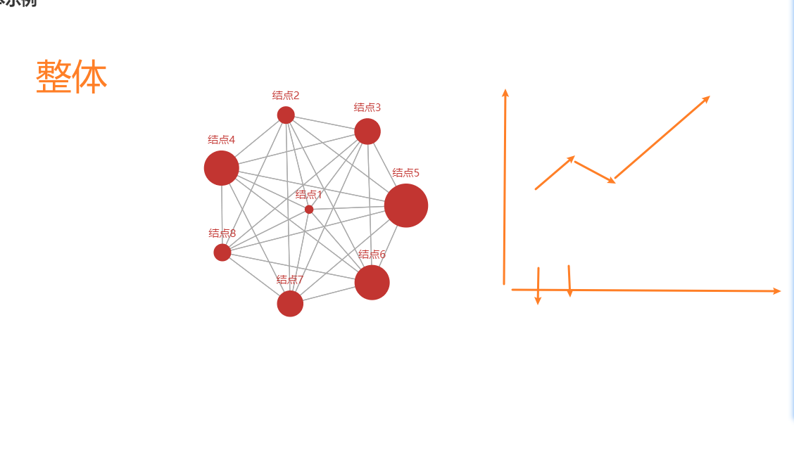
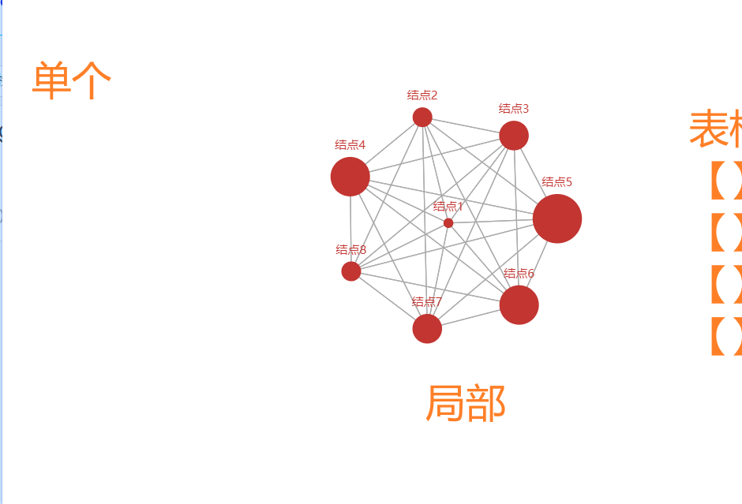

### 二、功能设计（长裙生产）

​	若查看整体数据，以折线图的形式展示；若查看单个数据，则以表格形式展示

1. 算法评估指标：F1值  -> float（**折线图**）
2. 算法运行时间：ti -> time
3. 预处理相关指标：……

#### 2. 故障根因实时定位与展示页面

1. 根因信息：echart -> graph
2. 具备网络拓扑
   1. 

#### 1.欢迎界面

​	展示QG图标、项目名称、背景

#### 整体性能页面

​	不需要下拉

1. **折线图**
   1. 算法评估指标：F1 score  -> float
   2. 算法运行时间：ti -> time
   3. 预处理相关指标：……
2. 全局拓扑图（可选）
   1. 一个系统内的节点，同一种颜色
   2. 不同系统的节点，需要用不同颜色
   3. 异常节点，特殊颜色
   4. 移动至根节点，显示异常信息

#### 3. 单个实例展示页面

​	选择某个数据，定位根因。

​	不需要下拉

1. 表格
   1. 算法评估指标：F1 score  -> float
   2. 算法运行时间：ti -> time
   3. 预处理相关指标：……
2. 局部拓扑图
   1. 移动至根节点，显示异常信息
   2. 异常节点，特殊颜色
   3. 动态……

